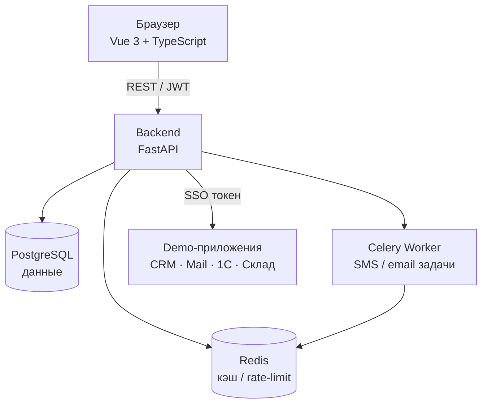

# IAM Platform — Единый портал доступа

Комплексная система управления доступом для корпоративной среды: MFA, SSO, RBAC, аудит и обнаружение аномалий.

## Развёртывание на сервере (production, одна команда)

На чистом Linux-сервере (Ubuntu/Debian) с публичным IP:

```bash
git clone https://github.com/AccReal/iam-portal.git
cd iam-portal
sudo bash deploy.sh
```

Скрипт сам:
- установит Docker (если нужно);
- возьмёт домен как `<публичный-IP>.sslip.io` (бесплатный DNS, без регистрации);
- сгенерирует `.env` с уникальными секретами;
- поднимет все сервисы за Caddy с **настоящим HTTPS (Let's Encrypt)** — браузер не ругается;
- прогонит миграции и наполнит БД тестовыми данными.

Свой домен (если есть, A-запись должна указывать на сервер):

```bash
sudo bash deploy.sh iam.example.com
```

После деплоя портал открывается на `https://<IP>.sslip.io`, сервисы — на поддоменах
(`odoo.`, `nextcloud.`, `grafana.`, `crm.`, `inventree.`, `mail.`).

> **Требование сети:** должны быть открыты входящие порты **80** и **443**
> (для firewall-провайдера — Timeweb и т.п. — добавьте правила allow на 80/443/22).
> Порт 80 нужен Caddy для выпуска SSL-сертификатов.

> **SSO у части сервисов** (Nextcloud, Odoo, InvenTree) требует разовой ручной
> привязки OIDC-провайдера через их админ-панель — см. комментарии в `docker-compose.yml`.

## Локальный запуск (разработка)

```bash
cp .env.example .env          # настроить переменные окружения
docker-compose up -d           # поднять все сервисы
docker-compose exec backend alembic upgrade head
docker-compose exec backend python seed.py
```

Приложения доступны по адресам:
- Портал: http://localhost:3000
- API / Swagger: http://localhost:8000/docs

Тестовые учётные записи (пароль `Test123456!@`):

| Email | Роль |
|-------|------|
| admin@company.ru | Администратор |
| marina@company.ru | Менеджер |
| petr@company.ru | Бухгалтер |
| olga@company.ru | Пользователь |

## Архитектура



## Стек технологий

| Слой | Технологии |
|------|-----------|
| Frontend | Vue 3, TypeScript, Ant Design Vue 4, Pinia, Vite |
| Backend | FastAPI, SQLAlchemy 2, Alembic, Celery |
| База данных | PostgreSQL 15, Redis 7 |
| Безопасность | JWT (HS256), Argon2, TOTP (pyotp), AES-256-GCM |
| Инфраструктура | Docker Compose |

## Основные возможности

- Аутентификация с JWT (access + refresh токены)
- Обязательный TOTP-MFA для всех пользователей
- RBAC с гибкой матрицей прав
- SSO (OAuth 2.0 / SAML) для внешних приложений
- Хранилище паролей (AES-256-GCM)
- Полный журнал аудита с экспортом CSV/XLSX
- Обнаружение аномалий: новые IP, геолокация, fingerprint устройства, honeypot
- Уведомления через Email и SMS (SMSC.ru)

## Документация

- [Архитектура системы](docs/ARCHITECTURE.md)
- [Руководство администратора](docs/ADMIN.md)
- [Руководство пользователя](docs/USER.md)

## Структура репозитория

```
iam-system/
├── backend/
│   ├── app/
│   │   ├── api/v1/      # эндпоинты (auth, users, roles, apps, sso, audit)
│   │   ├── models/      # SQLAlchemy модели
│   │   ├── schemas/     # Pydantic схемы
│   │   ├── services/    # бизнес-логика
│   │   └── tasks/       # Celery задачи
│   ├── tests/           # pytest (68 тестов)
│   └── alembic/         # миграции БД
├── frontend/
│   └── src/
│       ├── views/       # страницы: Login, Dashboard, Profile, Admin
│       ├── stores/      # Pinia stores
│       └── api/         # axios клиент
├── demo-apps/           # 4 десктопных SSO-приложения (Electron)
├── docker-compose.yml
└── .env.example
```

---

**Версия**: 1.0.0 | **Дипломная работа**: 2026
