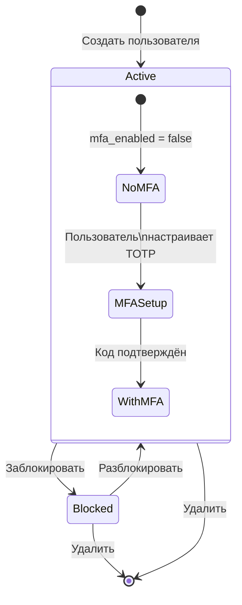
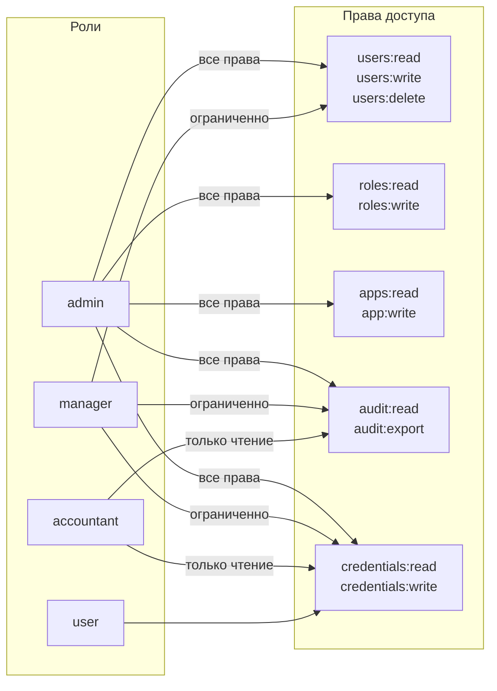
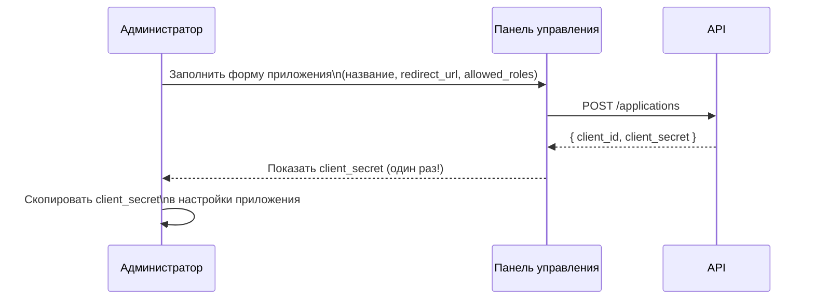
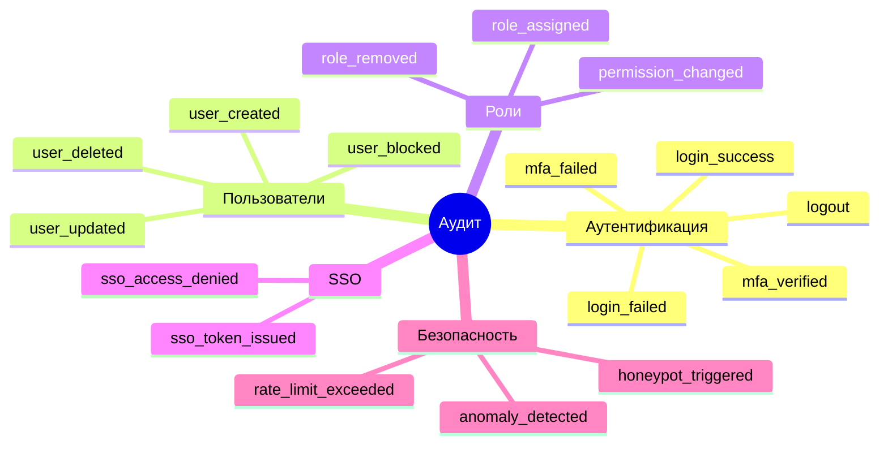

# Руководство администратора IAM Platform

## Доступ в панель администратора

Панель администратора доступна пользователям с ролью **admin**. После входа в систему перейдите в раздел **Администрирование** через навигационное меню.

URL: http://localhost:3000/admin

---

## Управление пользователями

### Жизненный цикл учётной записи



### Операции с пользователями

| Действие | Эндпоинт | Права |
|---------|---------|-------|
| Список пользователей | `GET /api/v1/users` | admin |
| Создать пользователя | `POST /api/v1/users` | admin |
| Редактировать | `PUT /api/v1/users/{id}` | admin |
| Заблокировать | `POST /api/v1/users/{id}/block` | admin |
| Разблокировать | `POST /api/v1/users/{id}/unblock` | admin |
| Удалить | `DELETE /api/v1/users/{id}` | admin |

### Создание пользователя

1. Перейти в **Администрирование → Пользователи**
2. Нажать **«Добавить пользователя»**
3. Заполнить: имя, email, пароль, роль
4. Нажать **«Сохранить»**

Пользователь получит уведомление на email. При первом входе он обязан настроить TOTP-MFA.

---

## Управление ролями и правами

### Матрица прав (RBAC)



### Изменение прав роли

1. **Администрирование → Роли**
2. Выбрать роль → кнопка **«Права»**
3. Отметить нужные чекбоксы → **«Сохранить»**

Изменения применяются немедленно ко всем пользователям с этой ролью.

---

## Управление приложениями (SSO)

### Процесс регистрации приложения



**Важно**: `client_secret` показывается только один раз при создании. Сохраните его немедленно.

### Поля приложения

| Поле | Описание |
|------|---------|
| Название | Отображаемое имя |
| `client_id` | Публичный идентификатор (генерируется) |
| `client_secret` | Секрет для SSO (генерируется, хранится хэш) |
| Разрешённые роли | Какие роли пользователей имеют доступ |
| Активно | Включить/выключить без удаления |

---

## Журнал аудита

### Типы событий



### Работа с журналом

1. **Администрирование → Журнал аудита**
2. Фильтрация по: пользователю, типу события, дате, IP-адресу
3. Экспорт: кнопка **«CSV»** или **«XLSX»**

Автоматическая очистка старых записей — задача Celery `cleanup_audit_logs` (запускается по расписанию).

---

## Мониторинг аномалий

Система автоматически вычисляет **risk_score** (0–100) для каждой сессии:

| Фактор | Добавляет |
|--------|----------|
| Новый IP-адрес | +20 |
| Новая геолокация | +30 |
| Новое устройство | +25 |
| Необычное время входа | +15 |
| Honeypot-запрос | +100 (блокировка) |

При `risk_score >= 70` администратор и пользователь получают уведомление.

---

## Резервное копирование

### База данных

```bash
docker-compose exec db pg_dump -U postgres iam_db > backup_$(date +%Y%m%d).sql
```

### Восстановление

```bash
docker-compose exec -T db psql -U postgres iam_db < backup_20260418.sql
```

### Redis (опционально)

```bash
docker-compose exec redis redis-cli BGSAVE
# файл dump.rdb в volume redis_data
```

---

## Конфигурация безопасности

Ключевые параметры в `.env`:

| Параметр | Значение по умолчанию | Описание |
|---------|----------------------|---------|
| `MFA_REQUIRED` | `True` | Запрещает вход без настроенного MFA |
| `ACCESS_TOKEN_EXPIRE_MINUTES` | `60` | Время жизни access-токена |
| `REFRESH_TOKEN_EXPIRE_DAYS` | `7` | Время жизни refresh-токена |
| `LOGIN_RATE_LIMIT` | `5` | Попыток входа в минуту |
| `AUDIT_RETENTION_DAYS` | `90` | Хранить записи аудита N дней |
