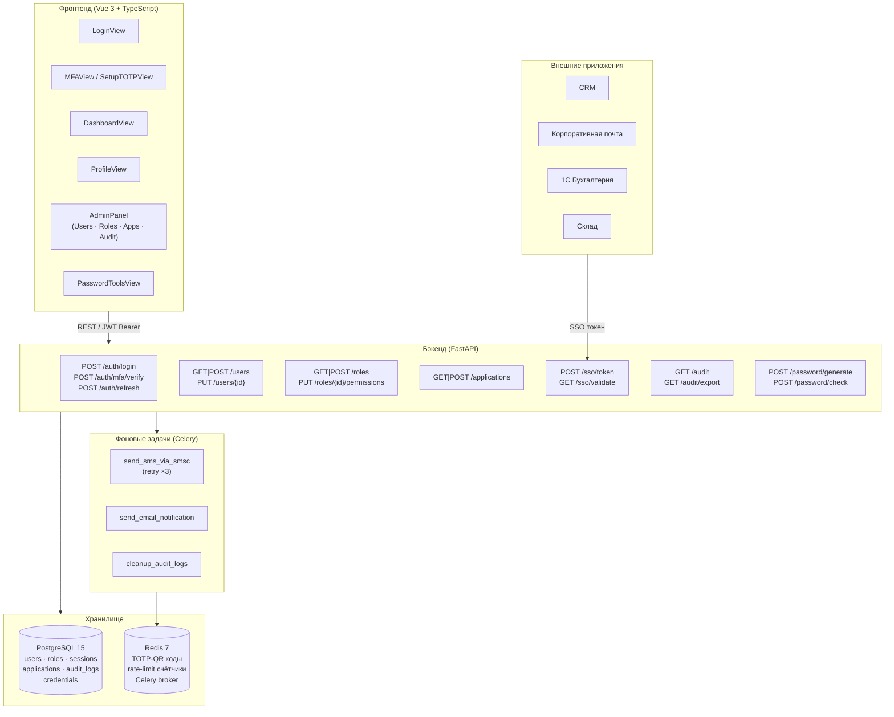
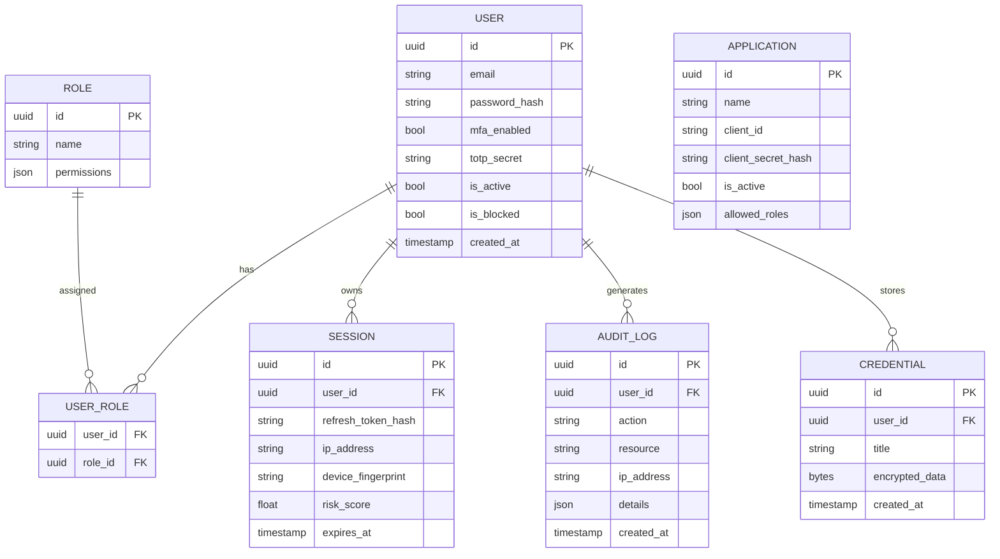
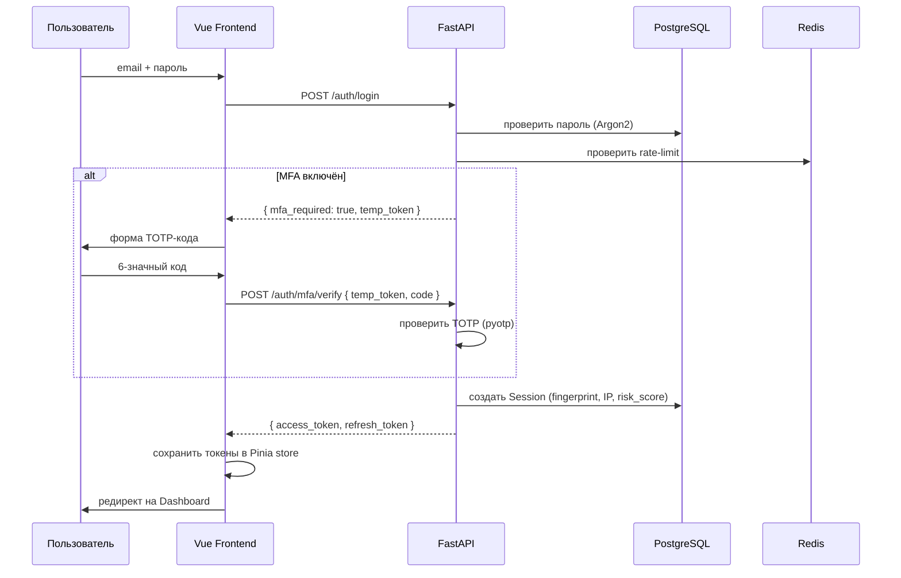
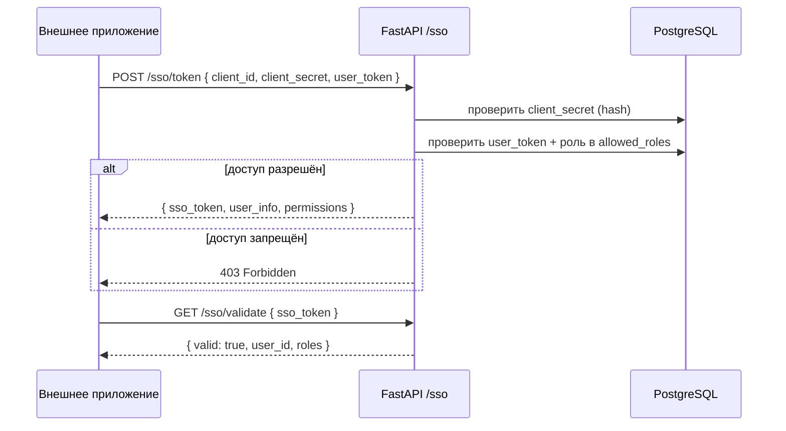
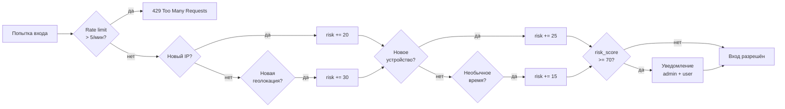
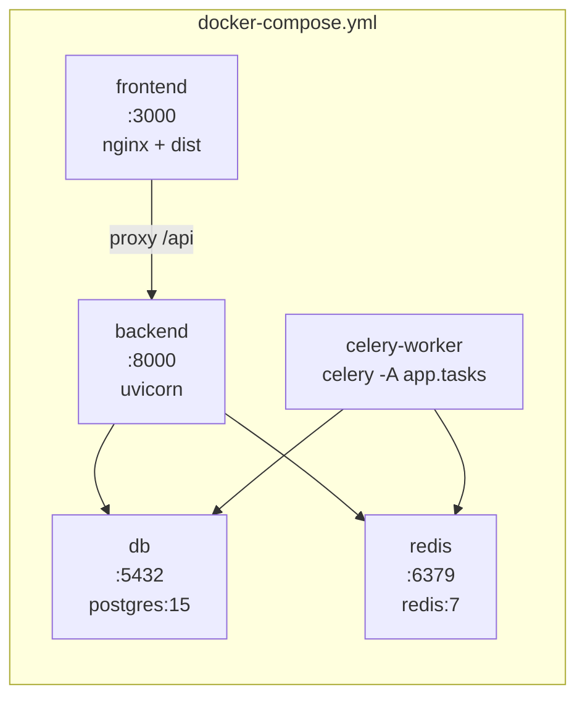

# Архитектура IAM Platform

## Обзор

IAM Platform — трёхзвенная веб-система (SPA + REST API + БД) с поддержкой асинхронных задач через Celery и интеграцией внешних приложений по протоколу SSO.

---

## Компоненты системы

---

## Модели данных

---

## Потоки аутентификации

### Логин с MFA

### SSO-интеграция внешнего приложения

---

## Обнаружение аномалий

---

## Развёртывание (Docker Compose)

**Переменные окружения** (`.env`):

| Переменная | Назначение |
|-----------|-----------|
| `DATABASE_URL` | asyncpg строка подключения |
| `REDIS_URL` | redis://redis:6379/0 |
| `JWT_SECRET_KEY` | ≥32 символа |
| `VAULT_MASTER_KEY` | 32-байтный hex ключ |
| `MFA_REQUIRED` | `True` — MFA обязателен |
| `SMSC_LOGIN` / `SMSC_PASSWORD` | SMS через SMSC.ru |
| `SMSC_ENABLED` | `false` — отключить SMS |
