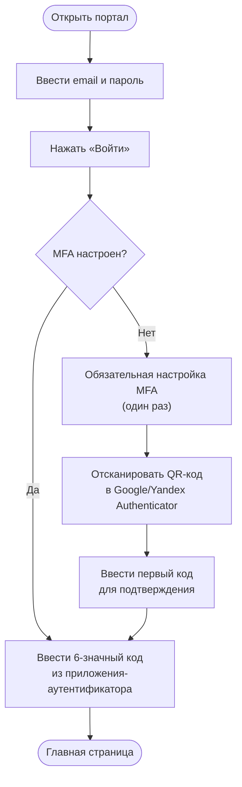
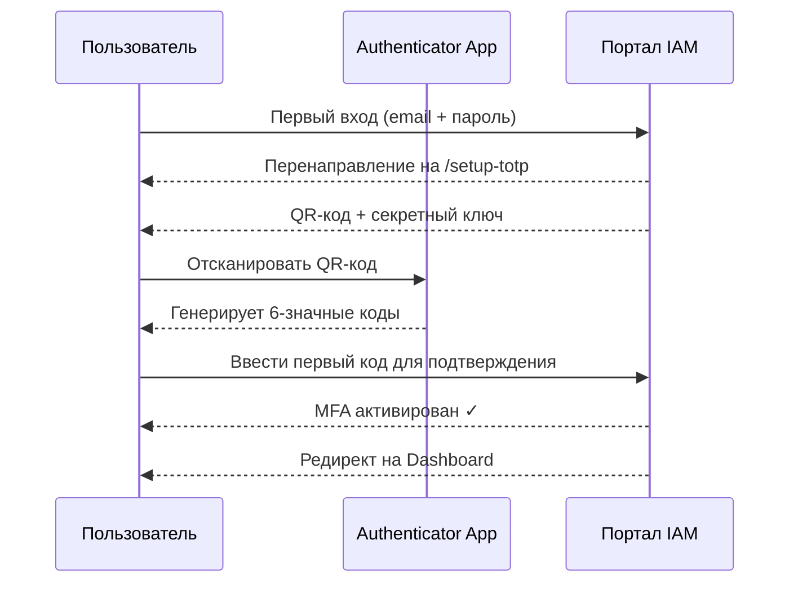
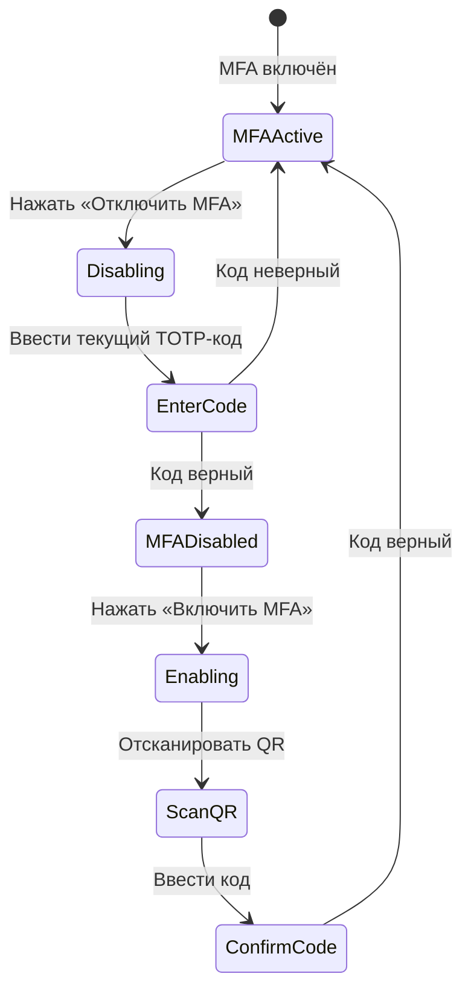
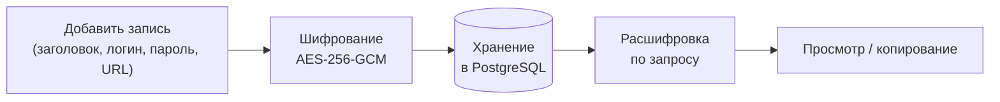
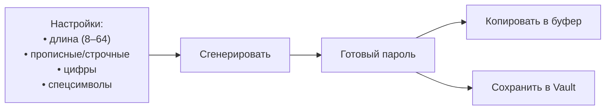
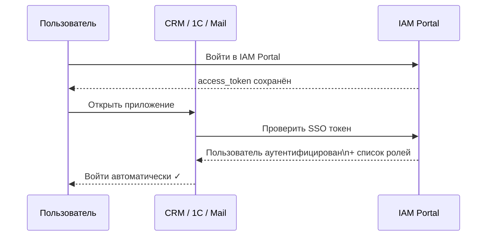

# Руководство пользователя IAM Platform

## Вход в систему

### Процесс аутентификации

### Поддерживаемые приложения-аутентификаторы

- Google Authenticator (Android / iOS)
- Yandex Key
- Microsoft Authenticator
- Authy

---

## Настройка MFA (первый вход)

При первом входе система обязательно перенаправит на страницу настройки TOTP.

**Сохраните секретный ключ** — он понадобится при смене устройства.

---

## Личный кабинет (Profile)

Раздел **Профиль** (иконка пользователя в шапке) содержит:

### Вкладка «Основное»
- Изменить имя и фамилию
- Изменить пароль (требует текущий пароль)

### Вкладка «Безопасность»

- **Включить/отключить MFA** — требует подтверждения текущим TOTP-кодом
- **Активные сессии** — просмотр и завершение сессий на других устройствах

### Вкладка «Сессии»

Отображает все активные сессии с указанием:
- IP-адреса и устройства
- Времени последней активности
- Оценки риска (risk score)

Кнопка **«Завершить»** отзывает refresh-токен выбранной сессии.

---

## Хранилище паролей (Vault)

Раздел для безопасного хранения учётных данных. Все данные шифруются алгоритмом **AES-256-GCM** на стороне сервера.

### Операции с записями

| Действие | Описание |
|---------|---------|
| Добавить | Кнопка «+» → заполнить форму |
| Просмотреть пароль | Иконка «глаз» у записи |
| Скопировать пароль | Иконка «копировать» |
| Редактировать | Иконка «карандаш» |
| Удалить | Иконка «корзина» → подтвердить |

---

## Инструменты паролей

Раздел **«Инструменты»** доступен всем пользователям:

### Генератор паролей

### Проверка надёжности

Введите пароль и получите оценку:
- Энтропия (биты)
- Время перебора (brute-force estimate)
- Список уязвимостей (словарные слова, повторы, паттерны)

---

## SSO — вход в корпоративные приложения

После входа в портал IAM вы автоматически получаете доступ к подключённым приложениям без повторного ввода пароля.

### Доступные приложения

| Приложение | Роли с доступом |
|-----------|----------------|
| CRM | admin, manager |
| Корпоративная почта | admin, manager, accountant |
| 1С Бухгалтерия | admin, accountant |
| Склад | admin |

---

## Уведомления

Система автоматически отправляет уведомления при:
- Входе с нового IP-адреса или устройства
- Подозрительной активности (высокий risk score)
- Блокировке учётной записи
- Изменении пароля или MFA

Уведомления отправляются на **email** и/или **SMS** в зависимости от настроек системы.

---

## Часто задаваемые вопросы

**Q: Потерял телефон с приложением-аутентификатором — как войти?**
Обратитесь к администратору системы. Администратор может сбросить MFA для вашей учётной записи.

**Q: Почему мне отказано в доступе к приложению?**
Доступ к приложениям определяется вашей ролью. Обратитесь к администратору для назначения нужной роли.

**Q: Как долго действует сессия?**
Access-токен действует **60 минут**, после чего автоматически обновляется (если вы активны). Refresh-токен действует **7 дней**.

**Q: Безопасно ли хранить пароли в Vault?**
Да. Все данные шифруются алгоритмом AES-256-GCM с уникальным ключом на стороне сервера до записи в базу данных.
